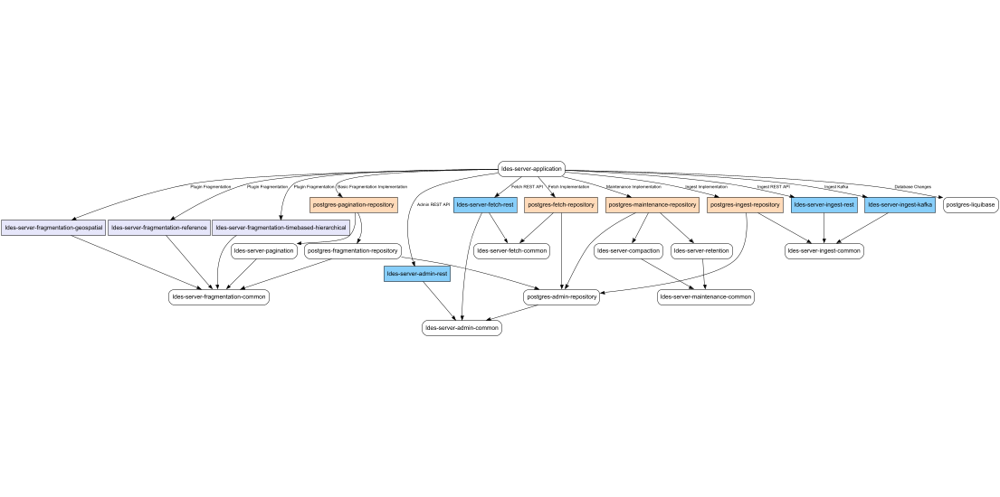

# LDES Server

The Linked Data Event Stream (LDES) server is a configurable component that can be used to ingest, store, transform
and (re-)publish an [LDES](https://semiceu.github.io/LinkedDataEventStreams/).
The LDES server was built in the context of
the [VSDS project](https://vlaamseoverheid.atlassian.net/wiki/spaces/VSDSSTART/overview) in order to easily exchange
open data.

[](https://sonarcloud.io/summary/new_code?id=Informatievlaanderen_VSDS-LDESServer4J)

## Table Of Contents

- [LDES Server](#ldes-server)
    - [Table Of Contents](#table-of-contents)
    - [Structure of the application](#structure-of-the-application)
    - [How To Run](#how-to-run)
        - [Maven](#maven)
    - [Developer Information](#developer-information)
        - [How To Build](#how-to-build)
        - [How To Test and View Coverage](#how-to-test-and-view-coverage)
            - [Unit and Integration Tests](#unit-and-integration-tests)
            - [Only Unit Tests](#only-unit-tests)
            - [Only Integration Tests](#only-integration-tests)
        - [Tracing and Metrics](#tracing-and-metrics)
            - [Local Tracing and Metrics](#local-tracing-and-metrics)
            - [Pyroscope instrumentation](#pyroscope-instrumentation)
            - [Using Docker](#using-docker)
        - [Health and Info](#health-and-info)
            - [Local Health and Info](#local-health-and-info)
            - [Docker](#docker)
            - [Exposing of details](#exposing-of-details)
        - [Logging](#logging)
            - [Logging configuration](#logging-configuration)

## Structure of the application

LDES Server Dependency Graph With All Profiles Activated:

Above is a dependency graph of the LDES server with all the profiles activated. 
The graph is color-coded as follows:
- **Orange**: Main functionalities
- **Blue**: Interfaces
- **Lavender**: Plugin fragmentations

The `ldes-server-domain` is the core domain module of the LDES server and is always loaded in.
To keep the graph clean, it is not shown.
Next to that, the `postgres-liquibase` module will always be loaded in to assure correct database creation.


The LDES server is built using the Spring Boot framework and is structured as a multi-module Maven project.
Each maven profile represents a different functionality of the LDES server that can be toggled.
The default exported image contains all the profiles, but a custom image can be created with only the needed
dependencies.

| Profile                    | Dependencies                                            | Description                                                                                                                 |
|----------------------------|---------------------------------------------------------|-----------------------------------------------------------------------------------------------------------------------------|
| `fragmentation`            | `postgres-pagination-repository`                        | Allows basic fragmentation (pagination)                                                                                     |
| `maintenance`              | `postgres-maintenance-repository`                       | Allows the LDES server to perform maintenance operations on its Event Streams and Members: compaction, retention, deletion. |
| **Interfaces**             |                                                         |                                                                                                                             |
| `http-admin`               | `ldes-server-admin-rest`,`postgres-admin-repository`*   | Gives access to REST API to create and manage Event Streams and Views.                                                      |
| `http-ingest`              | `ldes-server-ingest-rest`,`postgres-ingest-repository`  | Gives access to REST API to ingest members into the LDES.                                                                   |
| `kafka-ingest`             | `ldes-server-ingest-kafka`,`postgres-ingest-repository` | Allows Kafka member ingestion into the LDES.                                                                                |
| `http-fetch`               | `ldes-server-fetch-rest`,`postgres-fetch-repository`    | Gives access to REST API to fetch Event Streams, its Views and pages.                                                       |
| **Plugin Fragmentations**  |                                                         |                                                                                                                             |
| `fragmentation-timebased`  | `ldes-server-fragmentation-timebased-hierarchical`      | Allows fragmentation in based on a timebased property.                                                                      |
| `fragmentation-geospatial` | `ldes-server-fragmentation-geospatial`                  | Allows fragmentation in based on a geospatial property.                                                                     |
| `fragmentation-reference`  | `ldes-server-fragmentation-reference`                   | Allows fragmentation in based on a textual property.                                                                        |


*: The `postgres-admin-repository`, as shown by the dependency graph, will be loaded in by the other above-mentioned functionality profiles. 
But when used separately, it needs to be loaded in manually.

## How To Run

To run the LDES server, we refer to the versioned documentation available [here](https://informatievlaanderen.github.io/VSDS-LDESServer4J/).

### Maven

To locally run the LDES server in Maven, move to the `ldes-server-application` directory and run the Spring Boot
application.

This can be done as follows:
> **_NOTE:_**  Due to an authorisation issue in GitHub packages, the easiest way is to first build the project using the
> following command:
> ```mvn
>  mvn install
> ```

```shell
cd ldes-server-application
```

```mvn
mvn spring-boot:run -P{profiles (comma separated with no spaces) }
```

The needed profiles can be found in the Structure of the application section.

## Developer Information

### How To Build

For compilation of the source code, execute the following command

```
mvn clean compile
```

### How To Test and View Coverage

Below the three options to run tests (only unit test, only integration tests and both unit and integration tests) are
listed.
To view the coverage of each option it's sufficient to add the option `-Pcoverage` after the command.
This generates a file in the `target` folder called `jacoco.exec`. This file reports the code coverage.
The combined coverage can also be seen via SonarCloud.

#### Unit and Integration Tests

For running all the tests of the project, execute the following command

```
mvn clean verify
```

#### Only Unit Tests

For running the unit tests of the project, execute the following command

```
mvn clean verify -Dintegrationtestskip=true
```

#### Only Integration Tests

For running the integration tests of the project, execute the following command

```
mvn clean verify -Dunittestskip=true
```

### Tracing and Metrics

Additionally, it is possible to keep track of metrics and tracings of the LDES Server.
This will be done through a Zipkin exporter for traces and a Prometheus endpoint for Metrics.

The exposed metrics can be found at `/actuator/prometheus`.

Both traces and metrics are based
on [OpenTelemetry standard](https://opentelemetry.io/docs/concepts/what-is-opentelemetry/)

To achieve this, the following properties are expected

#### Local Tracing and Metrics

```yaml
management:
  tracing:
    sampling:
      probability: 1.0
  zipkin:
    tracing:
      endpoint: "zipkin endpoint of collector"
  endpoints:
    web:
      exposure:
        include:
          - prometheus
```

The export of traces can be disabled with the following parameter:

```yaml
management:
  tracing:
    enabled: false
  ```

#### Pyroscope instrumentation

To enable pyroscope, add the following to the application.yml file:

```yaml
pyroscope:
  agent:
    enabled: true
```

Note that this does not work when running the server locally on a Windows device.

The normal pyroscope properties can be
found [here](https://grafana.com/docs/pyroscope/latest/configure-client/language-sdks/java/#java-client-configuration-options)
These properties should be added to the env variables.

#### Using Docker

```
SPRING_SLEUTH_OTEL_EXPORTER_JAEGER_ENDPOINT="endpoint of collector"
MANAGEMENT_ENDPOINTS_WEB_EXPOSURE_INCLUDE="prometheus"
MANAGEMENT_TRACING_SAMPLING_PROBABILITY="1.0"
MANAGEMENT_ZIPKIN_TRACING_ENDPOINT="zipkin endpoint of collector"
```

The export of traces can be disabled with the following parameter:

```
MANAGEMENT_TRACING_ENABLED=false
```

### Health and Info

To allow more visibility for the application, it is possible to enable a health and info endpoint.

This health endpoint provides a basic JSON output that can be found at `/actuator/health` that provides a summary of the
status of all needed services.

An additional info endpoint is also available which shows which version of the application running and its deployment
date.

#### Local Health and Info

The following config allows you to enable both the info and health endpoints.

```yaml
management:
  endpoints:
    web:
      exposure:
        include:
          - health
          - info
  health:
    defaults:
      enabled: false
    mongo:
      enabled: true
    dcat:
      enabled: true
  endpoint:
    health:
      show-details: always
  ```

#### Docker

```
MANAGEMENT_ENDPOINTS_WEB_EXPOSURE_INCLUDE="health, info"
MANAGEMENT_HEALTH_DEFAULTS_ENABLED=false
MANAGEMENT_HEALTH_MONGO_ENABLED=true
MANAGEMENT_HEALTH_DCAT_ENABLED=true
MANAGEMENT_ENDPOINT_HEALTH_SHOW-DETAILS="always"
```

#### Exposing of details

With the above config, where `management.endpoint.health.show-details=true`, all the details of the declared health
components are exposed. The details that should not be exposed, can be hidden by two ways.

1. Disabling unnecessary details \
   The details that should not be exposed, can be disabled. This can be achieved by disabling all the defaults and
   enabling the required details only, just like the above config, or by enabling the required details only.
   This can be done with the following property: `management.endpoints.<component-name>.enabled=<true/false>`

2. Declaring a group and include there all the desired details \
   With the following config, a group is created that exposes all its details of the components within this group. This
   ensures that other details that are not part of this group are not exposed.
    ```yaml
    management:
      endpoint:
        health:
          show-details: always
          group:
            dcat-validity:
              show-details: always
              include: dcat
    ```

### Logging

The logging of this server is split over the different logging levels according to the following guidelines.

- TRACE: NONE
- DEBUG: Standard operations like: create fragment, ingest member, assign member to fragment
- INFO: NONE
- WARN: Potentially unintended operations like: Duplicate Member Ingest, ...
- ERROR: All Exceptions

#### Logging configuration

The following config allows you to output logging to the console. The trace id and span id can be included in the
logging,
if enabled via the [tracing config](#tracing-and-metrics).
Further customization of the logging settings can be done using the logback properties. A use case for this can be
sending the logs to Loki for example.

```yaml
logging:
  pattern:
    console: "%5p [${spring.application.name:LDESServer4J},%X{traceId:-},%X{spanId:-}]"
  level:
    root: INFO
```

The following config enables and exposes the loggers endpoint.

```yaml
management:
  endpoint:
    loggers:
      enabled: true
  endpoints:
    web:
      exposure:
        include:
          - loggers
```

To change the logging level of the application at runtime, you can send the following POST request to the loggers
endpoint.
Replace [LOGGING LEVEL] with the desired logging level from among: TRACE, DEBUG, INFO, WARN, ERROR.

```
curl -i -X POST -H 'Content-Type: application/json' -d '{"configuredLevel": "[LOGGING LEVEL]"}'
  http://localhost:8080/actuator/loggers/ROOT
```

## Fork this repository
There are some secrets and variables that you need to set in order to run the Github Actions. 

There are some extra functionalities that you can enable by setting the following variables:

`ANALYSE_PACKAGE`: when this is set to `true`, the Github Actions will run the SonarCloud analysis. You'll need to set
the `SONAR_ORGANIZATION` and `SONAR_PROJECT_KEY` variables and the `SONAR_TOKEN` secret.

`DEPLOY_DOCUMENTATION`: when this is set to `true`, the Github Actions will deploy the documentation to the Github Pages.
You'll need to set the `GIT_CONFIG_USERNAME` and `GIT_CONFIG_EMAIL` variables and the `DEPLOY_DOCS_PAT` secret.

`DEPLOY_PACKAGE_TO_OSSRH`: when this is set to `true`, the Github Actions will deploy the package to the OSSRH.


### Secrets

| Secret name                   | Description                                                                       |
|-------------------------------|-----------------------------------------------------------------------------------|
| DEPLOY_DOCS_PAT               | a personal access token with the `repo` scope                                     |
| DOCKER_PASSWORD               | Docker hub user password                                                          |
| DOCKER_USER                   | Docker hub username or email address                                              |
| OSSRH_GPG_SECRET_KEY          | GPG private key to use when signing the artifacts for publishing to Maven central |
| OSSRH_GPG_SECRET_KEY_PASSWORD | The passphrase to use when signing the artifacts for publishing to Maven central  |
| OSSRH_USERNAME                | Username for Maven Central                                                        |
| OSSRH_TOKEN                   | Token for Maven Central                                                           |
| SONAR_TOKEN                   | Token for publishing Sonar reports to Sonar cloud                                 |
| SSH_PRIVATE_KEY               | The SSH private key to release Maven artifacts                                    |

### Variables

| Variable name           | Description                                                                                            | Example                                |
|-------------------------|--------------------------------------------------------------------------------------------------------|----------------------------------------|
| ANALYSE_PACKAGE         | Choose if you want to execute the Sonar scan and publish the reports to Sonar cloud                    | false                                  |
| DEPLOY_DOCUMENTATION    | Choose if you want to create and deploy the documentation to Github pages                              | false                                  |
| DEPLOY_PACKAGE_TO_OSSRH | Choose if you want to deploy the Maven package to Maven Central                                        | false                                  |
| DOCKER_NAMESPACE        | The namespace where the Docker image should be published under (in Docker hub)                         | ldes                                   |
| GIT_CONFIG_EMAIL        | The Git email address that is used for committing the Github pages and create new releases             | vsds-ci@users.noreply.github.com       |
| GIT_CONFIG_USERNAME     | The Git username that is used for committing the Github pages and create new releases                  | VSDS CI Pipeline                       |
| SONAR_ORGANIZATION      | The organisation of the Sonar project                                                                  | informatievlaanderen                   |
| SONAR_PROJECT_KEY       | The project key of the Sonar project                                                                   | Informatievlaanderen_VSDS-LDESServer4J |
| JAVA_VERSION            | The Java version to use to build the project in the Github actions                                     | 21                                     |
| JAVA_DISTRIBUTION       | The Java distribution to use to build the project in the Github actions (temurin, zulu, corretto, ...) | zulu                                   |

