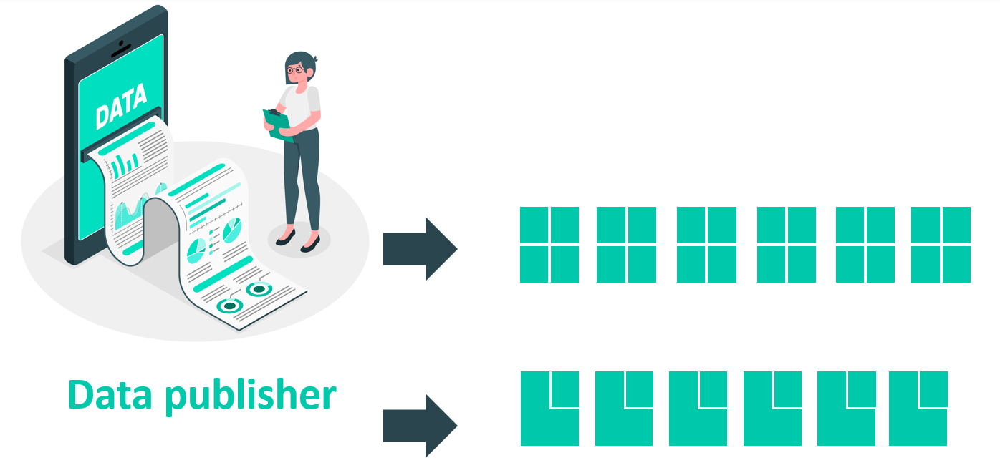

# LDES Fragmentations

To reduce the volume of data that consumers need to replicate or to speed up certain queries, 
the LDES server can be configured to create several fragmentations. 
Fragmentations are similar to indexes in databases but then published on the Web. 
The RDF predicate on which the fragmentation must be applied is defined through configuration.

The fragmenting of a Linked Data Event Stream (LDES) is a crucial technique for managing and processing large amounts of data more efficiently.

## Partitioning

By default, every Event Stream will be partitioned, wich means that the LDES server will create fragments based on the order of arrival of the LDES member.
The members arriving on the LDES server are added to the first page, while the latest members are always included on the latest page.

**Algorithm**

1. The fragment to which the member should be added is determined.
    - The currently open fragment is retrieved from the database.
    - If this fragment contains members equal to or exceeding the member limit or no fragment can be found, a new fragment is created instead.
2. If a new fragment is created, the following steps are taken.
    - The new fragment becomes the new open fragment and the previous fragment becomes immutable1.
    - This newly created fragment and the previous fragment are then linked with each other by 2 generic relationships1.
    - The pagenumber of the new fragment is determined based on the old fragment or is set to 1 in case of the first fragment.

1 In case of the first fragment, a previous fragment does not exist so these steps are skipped.

## Default Fragment

If a member is fragmented that can not be added to any fragment (ex. the fragmentation property is missing or not valid), then the member will be added to a default fragment.
This is a responsibility of the individual fragmentation strategy so if a custom fragmentation strategy is created it must also implement this logic.

## Supported Fragmentations: