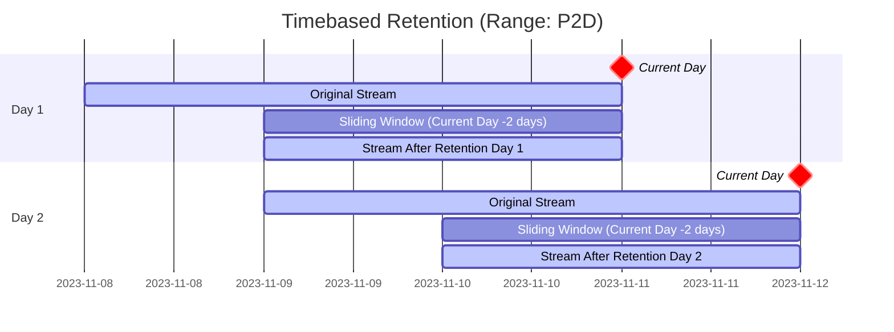

# Timebased Retention Policy
[https://w3id.org/ldes#DurationAgoPolicy]()

Similar to the [Point in Time Retention Policy](./point-in-time), 
the Timebased Retention Policy will filter out members based on their `ldes:timestampPath`.
The difference between the previous retention policy is that the Timebased one works with a 
sliding window, rather than a hard-set value.

The sliding window can be defined with a [ISO 8601 Temporal Duration](https://tc39.es/proposal-temporal/docs/duration.html).
Any members' `ldes:timestampPath` that falls outside of this range will be removed.



## Example 

```turtle
  @prefix ldes: <https://w3id.org/ldes#> .
  @prefix tree: <https://w3id.org/tree#>.

  <view1> a tree:Node ;
    tree:viewDescription [
      a tree:ViewDescription ;
      ldes:retentionPolicy [
        a ldes:DurationAgoPolicy ;
        tree:value "PT10M"^^<http://www.w3.org/2001/XMLSchema#duration> ;
      ] ;
    ] .
  ```