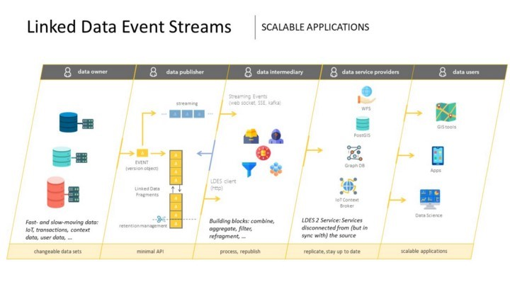

# Linked Data Event Stream Server

## Introduction

The Linked Data Event Stream (LDES) server is a configurable component that can be used to ingest, store, transform and (re-)publish an [LDES](https://semiceu.github.io/LinkedDataEventStreams/).

The LDES server was built in the context of the [VSDS project](https://vlaamseoverheid.atlassian.net/wiki/spaces/VSDSSTART/overview) in order to easily exchange data.

The server can be configured to meet the organisation's specific needs. Functionalities include **retention policy**, **fragmentation**, **deletion** and **pagination** for managing and processing large amounts of data more efficiently and ensuring the efficient use of storage.

