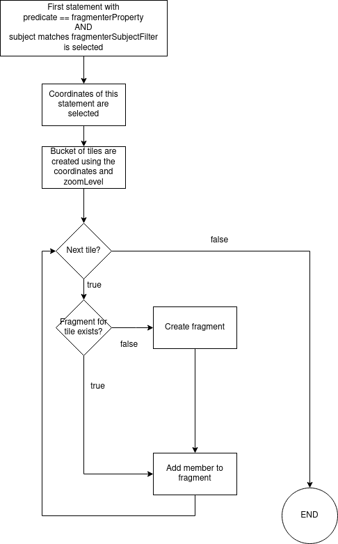

# Geospatial fragmentation

Geospatial fragmentation will create fragments based on geospatial tiles selected of the `fragmenterProperty`.
This allows you to fragment the data on geolocations.

## Properties

  ```yaml
  name: "geospatial"
  config:
    maxZoomLevel: { Mandatory: Required zoom level }
    fragmenterProperty: { Mandatory: defines which property will be used for bucketizing }
    fragmenterSubjectFilter: { Optional: regex to filter the subjects matching the fragmenterProperty }
  ```

## Algorithm

1. The fragmentationObjects of the member are determined
   - We filter the RDF statements where the predicate matches the `fragmenterProperty`
   - If an optional regex is provided through the `fragmenterSubjectFilter` property, we filter on subjects that match this regex.
   - We select all the object that pass the above filters.
2. A bucket of tiles is created using the coordinates and provided zoomLevel. [This is done using the Slippy Map algorithm.](https://wiki.openstreetmap.org/wiki/Slippy_map)  
3. The tiles are iterated. The member is added to every tile, or sub-fragmentations of these tiles<sup>1</sup>. Taking into account:
   - A new fragment is created if no fragment exists for the given tile.
   - There is no `memberLimit` or max size for a fragment. They do not become immutable.
   - The member is added to every related fragment

<sup>1</sup> If the geospatial fragmentation is not the lowest fragmentation level, the member is not added to the tile but to a subfragment on this tile. This case is included in the [example below](#when-we-have-a-timebased-sub-fragmentation-below-geospatial-fragmentation).



## Example

Example properties:

  ```yaml
  name: "geospatial"
  config:
    maxZoomLevel: 15
    fragmenterProperty: "http://www.opengis.net/ont/geosparql#asWKT"
  ```

With following example input:

```ttl
@prefix dc: <http://purl.org/dc/terms/> .
@prefix ns0: <http://semweb.mmlab.be/ns/linkedconnections#> .
@prefix xsd: <http://www.w3.org/2001/XMLSchema#> .
@prefix ns1: <http://vocab.gtfs.org/terms#> .
@prefix prov: <http://www.w3.org/ns/prov#> .
@prefix ns2: <http://www.opengis.net/ont/geosparql#> .
@prefix rdfs: <http://www.w3.org/2000/01/rdf-schema#> .
@prefix geo: <http://www.w3.org/2003/01/geo/wgs84_pos#> .

<http://njh.me/original-id#2022-09-28T17:11:28.520Z>
  dc:isVersionOf <http://njh.me/original-id> ;
  ns0:arrivalStop <http://example.org/stops/402161> ;
  ns0:arrivalTime "2022-09-28T07:14:00.000Z"^^xsd:dateTime ;
  ns0:departureStop <http://example.org/stops/402303> ;
  ns0:departureTime "2022-09-28T07:09:00.000Z"^^xsd:dateTime ;
  ns1:dropOffType ns1:Regular ;
  ns1:pickupType ns1:Regular ;
  ns1:route <http://example.org/routes/Hasselt_-_Genk> ;
  ns1:trip <http://example.org/trips/Hasselt_-_Genk/Genk_-_Hasselt/20220928T0909> ;
  a ns0:Connection ;
  prov:generatedAtTime "2022-09-28T17:11:28.520Z"^^xsd:dateTime .

<http://example.org/stops/402161>
  ns2:asWKT "POINT (5.47236 50.9642)"^^ns2:wktLiteral ;
  a ns1:Stop ;
  rdfs:label "Genk Brug" ;
  geo:lat 5.096420e+1 ;
  geo:long 5.472360e+0 .

<http://example.org/stops/402303>
  ns2:asWKT "POINT (5.49661 50.9667)"^^ns2:wktLiteral ;
  a ns1:Stop ;
  rdfs:label "Genk Station perron 11" ;
  geo:lat 5.096670e+1 ;
  geo:long 5.496610e+0 .
```

The selected objects would be

`"POINT (5.47236 50.9642)"^^ns2:wktLiteral` and `"POINT (5.49661 50.9667)"^^ns2:wktLiteral`

When we convert these [coordinates to tiles](https://wiki.openstreetmap.org/wiki/Slippy_map_tilenames#Lon..2Flat._to_tile_numbers_2), the bucket of tiles would be:
- "15/16884/10974"
- "15/16882/10975"

### When geospatial fragmentation is the lowest level

After ingestion the member will be part of the following two fragments
- http://localhost:8080/addresses/by-zone?tile=15/16884/10974
- http://localhost:8080/addresses/by-zone?tile=15/16882/10975

### When we have a timebased sub-fragmentation below geospatial fragmentation

After ingestion the member will be part of the following two fragments
- http://localhost:8080/addresses/by-zone-and-time?tile=15/16884/10974&generatedAtTime=2023-02-15T10:14:28.262Z
- http://localhost:8080/addresses/by-zone-and-time?tile=15/16882/10975&generatedAtTime=2023-02-15T10:14:28.262Z

Note that the `generatedAtTime=2023-02-15T10:14:28.262Z` is an example, this can be any other fragmentation.