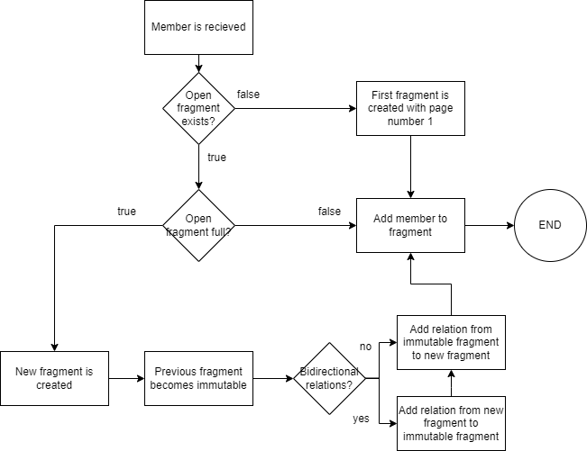

# Pagination fragmentation

Pagination fragmentation will create fragments based on the order of arrival of the members.
This is meant to be a standard way of fragmentation.

## Properties

  ```ttl
  @prefix tree: <https://w3id.org/tree#> .
  
  tree:fragmentationStrategy () .
  ```

## Algorithm

1. The fragment to which the member should be added is determined.
    - The currently open fragment is retrieved from the database.
    - If this fragment contains members equal to or exceeding the member limit or no fragment can be found, a new
      fragment is created instead.
2. If a new fragment is created, the following steps are taken.
    - The new fragment becomes the new open fragment and the previous fragment becomes immutable<sup>1</sup>.
    - This newly created fragment and the previous fragment are then linked with each other by 2 generic
      relationships<sup>1</sup><sup>2</sup>.
    - The pagenumber of the new fragment is determined based on the old fragment or is set to 1 in case of the first
      fragment.

<sup>1</sup> In case of the first fragment, a previous fragment does not exist so these steps are skipped.
<sup>2</sup> This is the default behaviour. If `bidirectionalRelations` is set to `false`, there will only be a relation
from the previous fragment to the new fragment.



## Example properties

  ```ttl
  @prefix tree: <https://w3id.org/tree#> .
  
  tree:fragmentationStrategy () .
  ```
