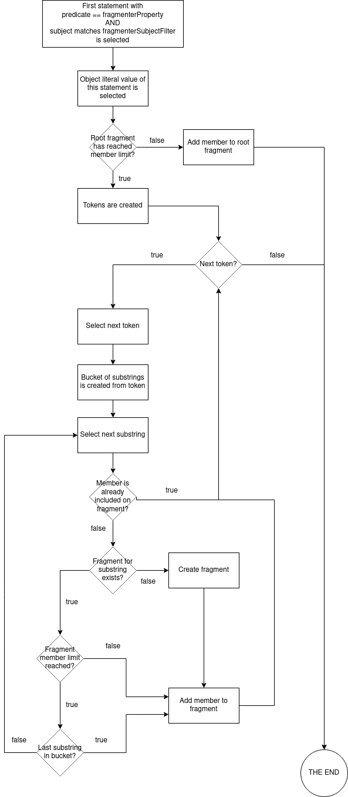

# Substring fragmentation

Substring fragmentation will create fragments based on substrings of the `fragmenterProperty`.
This allows you to efficiently implement autocompletion.

## Properties

  ```ttl
  @prefix example: <http://example.org/> .
  
  example:fragmentationStrategy [
        a example:Fragmentation ;
        example:name "substring";
        example:memberLimit { Mandatory:member limit > 0 } ;
        example:fragmenterProperty { Mandatory: defines which property will be used for bucketizing } ;
        example:fragmenterSubjectFilter { Optional: regex to filter the subjects matching the fragmenterProperty } ;
    ] .
  ```

## Algorithm

1. The fragmentationObject of the member is determined
   - We filter the RDF statements where the predicate matches the `fragmenterProperty`
   - If an optional regex is provided through the `fragmenterSubjectFilter` property, we filter on subjects that match this regex.
   - We select the object of the first statement that passes the above filters.
2. Tokens are created
   - The literal value of the selected object is normalized and split into substrings based on a space char " "
3. The tokens are iterated, with every token the following happens:
   - A bucket of substrings is created
      - The literal value of the selected object is split into substrings. For example:
        `example` is split into the following substrings: ` `, `e`, `ex`, `exa`, `exam`, `examp`, `exampl`, `example`
   - The substrings in the bucket are iterated from small (e.g. ` ` empty) to large (e.g. `example`). The member is added to the first possible fragment. Taking into account:
     - A new fragment is created if none exists.
     - When the fragment has reached the `memberLimit`, the member is not added but the next fragment is retrieved.
     - The member is only added to the fragment when it was not previously added by another token.
     - If all fragments are full, the member is always added to the last one (e.g. `example`) above. Ignoring the `memberLimit`.



## Example

Example properties:

  ```ttl
  @prefix example: <http://example.org/> .
  
  example:fragmentationStrategy [
    a example:Fragmentation ;
    example:name "substring";
    example:memberLimit "10" ;
    example:fragmenterProperty "https://data.vlaanderen.be/ns/adres#volledigAdres" ;
  ] .
  ```

With following example input:

  ```ttl
  @prefix prov: <http://www.w3.org/ns/prov#> .
  @prefix xsd: <http://www.w3.org/2001/XMLSchema#> .

  <https://data.vlaanderen.be/id/adres/1781020/2023-02-15T10:14:36.002Z>
    <https://data.vlaanderen.be/ns/adres#isVerrijktMet> [ 
      <https://data.vlaanderen.be/ns/adres#volledigAdres> "Kazernestraat 15, 9160 Lokeren"@nl 
    ] ;
    prov:generatedAtTime "2023-02-15T10:14:36.002Z"^^xsd:dateTime ;
    a <https://data.vlaanderen.be/ns/adres#Adres> .
```

The selected object would be "Kazernestraat 15, 9160 Lokeren".

The bucket of substrings would be:
- K
- Ka
- Kaz
- ...
- Kazernestraat 15, 9160 Lokeren

If this is the first member of the collection it would be added to fragment 'k' and available at http://localhost:8080/addresses/by-name?substring=k and not in ka or any other substring fragment.

In a scenario where there are already 10 addresses starting with 'k' and only 2 with 'ka', it would be added to http://localhost:8080/addresses/by-name?substring=ka

Note that this is all lowercase.